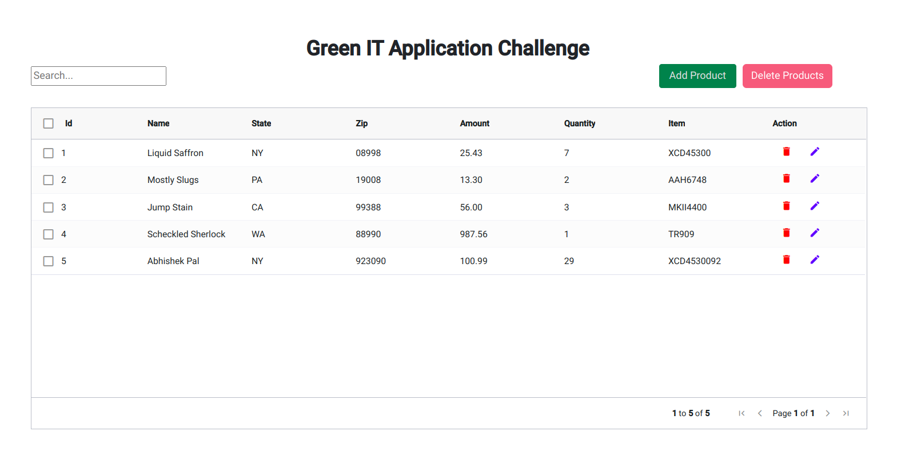
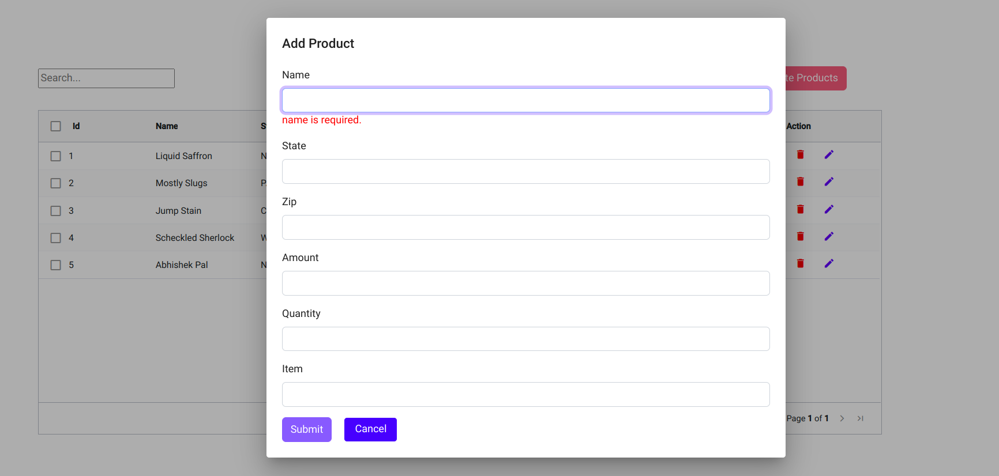
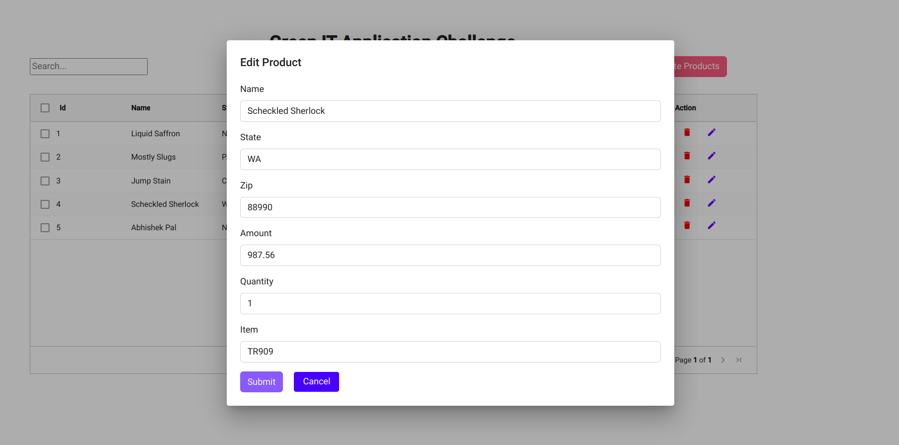
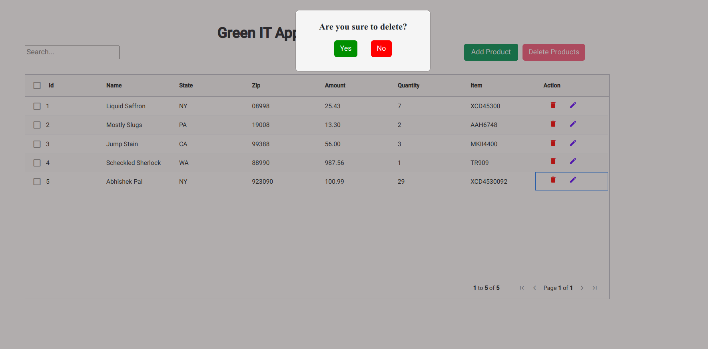
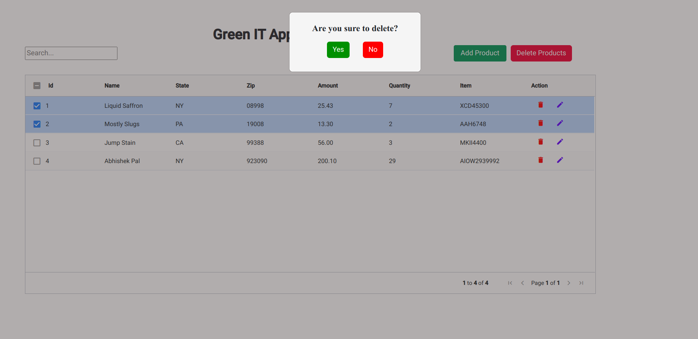

# Green-IT Application Challenge

    Application Screenshots

 -- Above is a screenshot of product list

 -- Above is a screenshot to add new product

 -- Above is a screenshot to edit product

 -- Above is a screenshot to delete single product

 -- Above is a screenshot to delete multiple product

# Application Used Framework & Language Details

 

    Backend

 

        Language : PHP

 

        PHP Version : 7.2

 

        PHP Framework : Core PHP
 

    Frontend

 

        Language : Typescript

 

        Framework Name : Angular

 

        Framework Version : 13

 

        UI : HTML

 

# Application Installation & configuration steps for run

 

        Angular Application:
        
            npm install
            ng serve 

 

        PHP Application:

            composer install --no-dev --ignore-platform-reqs
            composer init

# Application Unit Testing

        PHP Application:

        PHP Unit Test :  Codeception
            composer require "codeception/codeception"
            export PATH="$PATH:/path/to/your/project/vendor/bin"
            codecept run
            composer codecept
            vendor/bin/codecept bootstrap
            php vendor/bin/codecept run unit

